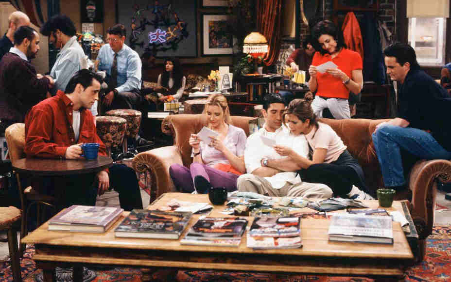
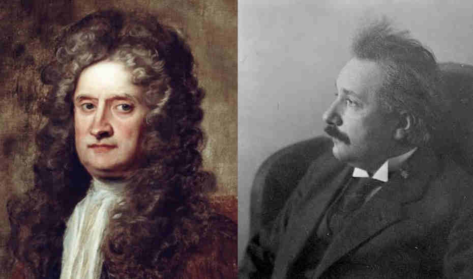
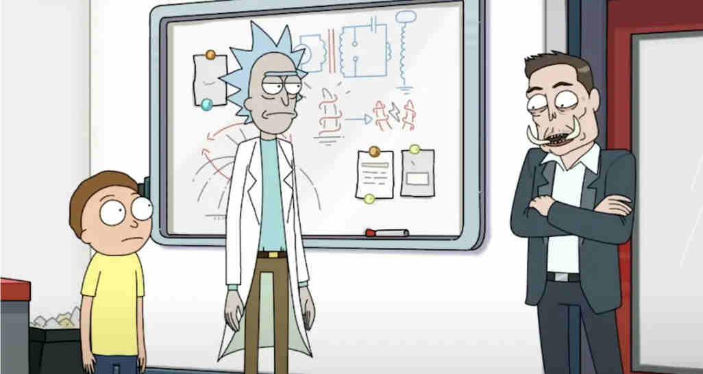

# Inference with mpirun

# Table of Contents

1. [What is this](#what-is-this)
2. [Usage](#usage)
3. [Examples](#examples)
4. [Cost](#cost)

## What is this

Despite being more memory effient than previous langauge foundation models, LLAMA still requires multiple-GPUs to run inference with. What if you don't have a beefy multi-GPU workstation/server?

Don't worry, this tutorial explains how to use `mpirun` to launch an LLAMA inference job across multiple cloud instances (one or more GPUs on each instance). Here are some key updates in addition to the [original llama repo](https://github.com/facebookresearch/llama) and [shawwn's fork](https://github.com/shawwn/llama):

- A [script](./setup_nodes.sh) to easily set up a "cluster" of cloud instances that is ready to run LLAMA inference (all models from 7B to 65B).
- `mpirun` compatible, so you can launch the job directly from the head node without the need of typing in the `torchrun` command on the worker nodes.
- Interactive inference mode across multiple nodes.
- `eos_w`: constrols how "lengthy" the results are likely to be by scaling the probability of `eos_token`.
- Inference speed profiling ("tokens/sec").

We will use [Lambda cloud](https://lambdalabs.com/service/gpu-cloud) as an example for the workflow and cost estimation, but the general workflow is applicable to other cloud plaforms too (as long as it supports ssh key login).

Also a quick note on our testing application -- we have seen great potential from LLAMA, in particular its ability to generate interesting scenes from simple prompt (one sentence specifies the location and characters). For example, here is one generated by the 65B LLAMA model for the prompt `[Scene: Central Perk, Chandler, Joey, Phoebe, and Monica are there.]`. Not only did it understand they are from the TV series "Friends", it also managed to write a fairly interesting play where Joe "helped" Chandler prefer for a skii trip with Janice, and Gunther finally asked Rachel out for a date. Make sure you expand the output to read the entire generated play.



<details>
  <summary>
    Prompt: [Scene: Central Perk, Chandler, Joey, Phoebe, and Monica are
    there.]

    Output:

    Chandler: Hey guys. I just got off the phone with Janice and
    she invited me to go skiing next weekend in Vermont!

    Joey: Skiing? You don't know how to ski do you?

  </summary>

```
Phoebe: Oh yeah right, that was one of his New Year's resolutions.
He still hasn't done it yet.

Monica: So what if he doesn't know how to ski, all you have to
do is point your skis straight downhill and hope for a soft landing
at the bottom.

Joey: Yeah, well, we can teach him. We can take turns teaching
him. (To Chandler) Okay, you come here, stand behind me, now
hold onto my shoulders like this, okay good. Now when I move,
you move, ready....go! Go! Go! Go!

(They both crash into the table.)

[Scene: Central Perk, Ross enters.]

Ross: Hello everybody. Hi. How ya doing? (Sits between Rachel
and Gunther) What're you up to tonight? Nothing much? Good. Me
neither.

Gunther: Uh...hey Rachel?

Rachel: Yep?

Gunther: Are you busy later on? 'Cause umm...you know...if you
wanna maybe get together or something...I wouldn't object.

Rachel: Well thanks but no thanks. Sorry. Maybe some other time
though.

Gunther: No problem. It'll be fun. Alright. Cool. See ya then.

Rachel: Wait a minute—what did you say?

Gunther: Umm...nothing.

Rachel: Didn't you ask me out on a date?

Gunther: A-a date? With me? Oh God. No, no. I mean, why would
you think that?

Ross: Because he asked you out on a date.

Gunther: Look I didn't want to tell anyone about this but uhh....I
had an accident last night. And I hit my head, pretty hard, and
I haven't been the same since. And I keep saying things that
I normally never ever say. Like asking people out, and telling
them that they look nice today. Things just come out of my mouth
without thinking.

Ross: So everything that's happened so far today has only been
because of the bump on your head?

Gunther: Yes. That's exactly it.

Rachel: Wow, that really sucks.

Gunther: Tell me about it. If anyone asks you anything weird
from here on in, please remember that I am not myself. Thank
you very much. Excuse me.

============== end sample 1 =================
```

</details>

## Usage

### Step one: launch instances

You can manually launch instances from the [Cloud Dashboard](https://cloud.lambdalabs.com/instances), or using the [Cloud API](https://docs.lambdalabs.com/cloud/launch-instance-api/). In the later case, you need to generate an API key, create a payload `request.json`, and then run the following command:

```
API-KEY=you-api-key
curl -u $API-KEY: https://cloud.lambdalabs.com/api/v1/instance-operations/launch -d @request.json -H "Content-Type: application/json" | jq .
```

### Step two: step up the instances

After the instances are launched (the `STATUS` column shows a green tick), we can move on to get the instances set up for running LLAMA distributedly:

- Give the head node passwordless access to all other nodes.
- Disable Infiniband for `NCCL` (since Lambda's on-demand instance doesn't support Infiniband).
- Set up a shared NFS.
- Clone the LLAMA repo and install dependencies.

We provide a shell script `setup_nodes` that automate these jobs. You need to set the variables at the begining of the script according to your own case:

```
LAMBDA_CLOUD_KEY="path-to-your-cloud-ssh-key"
HEAD_IP="head-node-public-ip"
WORKER_IP="worker-0-public-ip worker-1-public-ip"
```

Then run the setup_nodes.sh script:

```
./setup_nodes.sh
```

The `HEAD_IP` is the ip of the instance where you will set up NFS and launch distributed LLAMA inference jobs from. `WORKER_IP` is a string of space-separated IPs for the other instances.

NOTE: `setup_nodes.sh` will ask you to type `yes` and hit `enter` a few times. After that, you will have the minimal setup needed to run distributed PyTorch jobs on the cloud instances you just launched. You might also want to remove `home/ubuntu/.ssh/known_hosts` on your local machine in case the cloud instance you newly created has the same IPs as some other instances you used to have (although the chance is very small).

### Step three: download pre-trained ckpts

From the head instance, run this command to download the ckpts:

```
# Only download the 7B model
cd /home/ubuntu/shared/llama-dl && ./llama.sh 7B

# Only download all the models
cd /home/ubuntu/shared/llama-dl && ./llama.sh 7B,13B,30B,65B
```

### Step four: run LLAMA

From the head instance, launch interactive inference with `mpirun`

```
# 13B model inference with two nodes
mpirun -np 2 \
-H master-ip:1,worker-ip:1 \
-x MASTER_ADDR=master-ip \
-x MASTER_PORT=1234 \
-x PATH \
-bind-to none -map-by slot \
-mca pml ob1 -mca btl ^openib \
python /home/ubuntu/shared/llama/interactive.py \
--ckpt_dir /home/ubuntu/shared/llama-dl/13B \
--tokenizer_path /home/ubuntu/shared/llama-dl/tokenizer.model


# 65B model inference with eight nodes
mpirun -np 8 \
-H master-ip:1,worker-ip-0:1,worker-ip-1:1,worker-ip-2:1,worker-ip-3:1,worker-ip-4:1,worker-ip-5:1,worker-ip-6:1 \
-x MASTER_ADDR=master-ip \
-x MASTER_PORT=1234 \
-x PATH \
-bind-to none -map-by slot \
-mca pml ob1 -mca btl ^openib \
python /home/ubuntu/shared/llama/interactive.py \
--ckpt_dir /home/ubuntu/shared/llama-dl/65B \
--tokenizer_path /home/ubuntu/shared/llama-dl/tokenizer.model
```

## Examples


<details>
  <summary>
    Prompt: [Scene: an Irish pub in Manchester. Leo Messi sit with Pep Guardiola
    at a table discussing if he should join Manchester City]

    Output:
    Pep Guardiola (PG): “Come on mate, you know I’ve always wanted
    to work with you again!”

    Leo Messi (LM) : “I know that boss, but there are things I don’t
    like about England”…..

  </summary>

```
[The waiter comes by and asks them what they want for drinks.
LM looks up from the menu and gives him his order]

Waiter: “Okay sir, so two pints of Guinness then?”

LM: _Looks confused_…. “No! No nooo, I didn’t mean 2 beers! One
is enough”

(He turns back to PG while laughing).

LM: “You see? They just serve one thing here, it can get very
boring sometimes. But anyway, how do we go about this transfer?
Do I have to pay anything for it?”

PG: “Not really, Man city will take care of all that. You only
need to sign some documents when you arrive”.

“But why would they offer me such a contract without demanding
something from us first? Doesn’t make sense right now.”

PG: “Well, it does actually because they’re not getting anything
out of this deal either”

LM: “Oh okay, well then I guess it works out perfectly for everyone
involved”

PG: “Yeah man, yeah! This could finally bring football home.
Imagine playing alongside Aguero, De-Bruyne and Sterling, you
guys gonna win everything next season”

LM: “Wow!! That sounds fantastic, I think I might as well give
it try. Let’s call my agent”

PG: “Alright buddy, let’s do it”

[Messi picks up his phone and calls Jorge Mendes, who happens
to be sitting closeby with Josep Maria Bartomeu].

Jorge Mendes(JM): Hello Leo, what’s up? How was your trip?

LM: Good morning Mr. Mendes. Yeah, good flight, thanks for asking.
So, I’m thinking about joining Manchester City. What do you say?
Can they afford me?

JM: WOW!!! Are you kidding??? You wanna leave Barcelona??

LM: Yes, yes, I do. And please stop screaming into my ear. It
hurts. Anyway, what do you think we can negotiate?

JM: Negotiating with whom? We aren’t selling our best player
to another club, especially not to a rival league

LM: Oh cmon Jorgie, where’s the love bruh? Come on, help me with
this move.

JM: Nahhhh son, I can’t do it. I won’t betray Barca for any amount
of money. Sorry

LM: Okay fine, suit yourself. See ya later bro.

[Messi ends the conversation and puts down his phone. He turns
to face PG and shakes his head.]

LM: “Dammit, this guy is crazy. I told you we needed someone
else to handle this matter”

PG: “That’s alright, I still have other people working on this
deal. Don’t worry about it”

LM: “Good, thank God for that. Hey, you mind grabbing another
round?”

============== end sample 1 =================
```

</details>



<details>
  <summary>
    Prompt: [Scene: A coffee shop in London. Isaac Newton, seated at a table,
    is lost in thought when Albert Einstein walks in and approaches
    him.]

    Output:
    Albert Einstein (AE) : Hello there! My name's Albert Einstein;
    I'm from Zurich. What's your name?

    Isaac Newton (IN): Good day to you too. My name is Sir Isaac
    Newton; of Cambridge. And what might be the purpose of this interruption?

  </summary>

```
AE: Oh sorry for interrupting; I just wanted to introduce myself
since we seem to have so much in common. You see, I also study
physics

IN: Physics??!! That doesn't sound like any proper field to me!!!
Why don't you stick to something more useful instead, say mathematics
or astronomy?

AE: Well, my interests are not limited only to physics but they
do include both math as well as astrophysics - which is basically
applied physics that deals with celestial objects such as stars
& galaxies. So, it would be nice if you could give me some pointers
about how I should go about studying these fields.

IN: Well, first off let me correct you on one thing - 'astro-physics'
is an oxymoron because those who claim to deal with it are actually
dealing with metaphysics rather than real science. The true scientist
must focus his attention entirely upon tangible phenomena that
can be observed through our senses alone without having recourse
to supernatural causes. For example, consider gravity. We all
experience its effects everyday by observing falling objects
around us. Hence, the force called "gravity" exists and has an
influence over matter here on Earth. However, it does NOT make
sense to postulate the existence of similar forces affecting
distant stars & planets simply because there's no evidence supporting
their direct impact upon things on Earth - after all, even the
Moon itself exerts practically zero gravitational pull upon ordinary
objects here. Furthermore, we cannot observe the workings of
faraway heavenly bodies directly and therefore cannot hope to
understand them completely. Therefore, it makes little sense
to waste time trying to understand things beyond our sphere of
observation. Instead, we ought to devote ourselves towards understanding
the natural processes that govern life right here on earth. In
addition, since God is the creator of everything visible, he
must be responsible for creating these invisible things too.
But he'd never create anything evil or useless - hence, whatever
lies outside our immediate surroundings must be good & beneficial
to mankind. Thus, there's really nothing to worry about and we
should stop bothering ourselves unnecessarily about things we
know very little about.

AE: Hmmm.....well, I agree that we shouldn't spend too much of
our efforts investigating things whose nature we can't possibly
ever hope to fully comprehend. But then again, why did YOU spend
most of your career studying light??? After all, isn't light
supposed to be a form of radiation emanating from distant stars
and other heavenly bodies?

IN: Light IS NOT made up of particles nor waves coming from anywhere
else. It comes from within OURSELVES - i.e., we humans generate
the light rays we perceive whenever we look at external sources
of illumination. This is evident from the fact that we can detect
light ONLY when we open our eyes and look outwards into space
whereas we fail to notice any light inside our eyelids even though
there exist many tiny pores through which rays of sunlight enter
our skulls and reach deep down to our brain tissues themselves.
Since we can feel pain while being poked with sharp sticks, it
follows that any light entering our heads must be stopped dead
before reaching our brains. Therefore, we cannot feel the pain
caused by light rays because they get blocked somewhere along
the way. Also, since there're no nerve endings present inside
our retina except near the outer surface facing away from eye,
it stands to reason that there must be NO LIGHT at all inside
our eyes.

AE: Wow! Interesting theory. I had always believed that light
came from external luminous sources. Anyway, speaking of light,
I was wondering whether you could help explain some puzzling
facts regarding its behavior......you see, I recently conducted
an experiment involving prisms & rainbows wherein........

[At this point, IN cuts off AE midway]

IN: Hold on now! Don't tell me you believe that rubbish regarding
colors being produced by refracting white light using glass prisms?
Everyone knows that colors are merely different forms of darkness
created when white light gets obstructed from shining forth unhindered.
If you want proof of this, try looking at the color black through
a magnifying glass - you'll find that the image appears darker
still. Clearly, the blackness becomes denser as we view smaller
parts of it. Now imagine what happens if we keep zooming deeper
and deeper until we hit the subatomic level. Obviously, the blackness
will become infinite due to the complete blockage of ALL light
rays.

AE: Ummm.....I think maybe we should move onto another subject
instead. How about we talk about motion? Perhaps you can shed
some light on the following question: Is acceleration equal to
velocity divided by time OR distance covered per unit time??
Because according to classical mechanics, it depends on whether
the body's initial position is taken into account or not.

IN: Huh?? Who cares about such meaningless details as initial
positions etc? Motion involves CHANGES in velocities over TIME
intervals only. As for distances traveled, they're irrelevant
unless you happen to be measuring speeds. Besides, why use two
variables to describe motion when you can perfectly well use
just one instead? Velocity = distance/time is all you need to
remember! Period.

AE: Fair enough. Next topic please: Do you think that space is
absolute?

IN: Absolute Space? What kind of nonsense is THAT??? Of course
SPACE is relative; how else could one measure spatial dimensions??
All measurements involve comparisons between various entities
based solely upon RELATIONSHIPS among them. Without relationships,
there CANNOT BE ANY MEASUREMENT AT ALL! To take an extreme case,
suppose there existed absolutely ZERO mass in the entire universe

then how could we ever define weight?? Or length, area, volume
etc? There'd be nothing concrete against which we could compare
the values of such physical quantities - hence, they wouldn't
mean anything at all! Similarly, without any solid ground beneath
our feet, we couldn't possibly walk anywhere either - after all,
how can you walk across empty air? So you see, all our knowledge
is founded upon relationships & comparison among multiple factors.

AE: Okay. Let's assume that you're right. Then how come we never
hear about people experiencing dizziness during normal activities?
If indeed space were truly relative, they must surely feel disoriented
each time they move their limbs since the surrounding space would
shift accordingly leading to a change in perspective. Yet, that
NEVER seems to happen in practice. So what gives?

IN: Ha ha! Very funny Mr. Einstein. Are you telling me that you
actually believe in this ridiculous notion that our own movements
cause space to shift around US somehow? Surely, you jest. Have
you forgotten basic geometry already? Anybody can easily prove
that a triangle remains a triangle regardless of which vertex
is chosen as starting point. Likewise, the angles subtended at
the center of a circle remain unchanged irrespective of the radius
used in drawing the arc. So how can space behave differently?
Even if it were possible for space to undergo changes of orientation,
the same transformations MUST hold for EACH AND EVERY observer
otherwise they'd disagree amongst themselves about the directions
in which they're moving. Such a scenario would render any attempt
at scientific investigation utterly futile because we'd never
be able to reproduce experimental results consistently - a clear
impossibility.

AE: Alright. Just a couple last questions: First off, what's
your opinion on energy conservation laws? Shouldn't the total
amount of kinetic + potential energy remain constant in any closed
system?

IN: Laws?? Hahaha! Those pesky mathematicians have been inventing
new terms left, right & centre. I'd advise you to stay away from
such fancy concepts altogether. They may sound impressive but
serve no practical purpose whatsoever. Energy is a mere abstract
quantity that can neither be seen nor felt - thus, it holds no
value whatsoever. Real things like apples can be held in your
hand or placed into baskets & counted but not energy. Its utility
is restricted to theoretical discussions only; in reality, however,
it means jack squat.

Secondly, WHICHEVER direction a ball rolls in, its KINEMATIC
energy stays the SAME while its POTENTIAL ENERGY varies depending
on height above sea level. Therefore, the sum of kinetic + potential
energies DOES vary depending on the path taken by the ball.

Now, what exactly did you wish to ask next?

AE: Errrm....never mind, thanks for your valuable advice sir.
I guess we'd better call it a day.

(The two part ways)
============== end sample 1 =================
```

</details>



<details>
  <summary>
    Prompt: [Scene: Rick and Morty's garage laboratory. Rick is tinkering
    with a new invention while Morty watches. Elon Musk is about
    to enter the scene.]

    Output:
    Rick Sanchez (to himself): Hmm... I need more power! Where can
    I get some extra energy? Aha, I know what will work! I have just
    enough plutonium left from my last trip into another dimension.
    It'll do nicely for this experiment.

    Morty Smith: Hey Grandpa, why are you messing around with that
    thing again? You haven't been right since your accidental time
    travel adventure through the wormhole portal.

  </summary>

```
Elon Musk barges in unannounced: Hi guys, I was in town on business
so thought I would drop by. Whatcha up to today?

Morty: Oh hi Mr. Musk! We were doing an experiment with one of
grandpa's new inventions. But now we can't find it anywhere!
Do you know where it might be? Did you see anyone come inside
who could have taken it?

[Musk looks shiftily at his shoes and then stares out the window]

Musk: Umm nope - didn't notice anything unusual going on. Sorry
kids but I really must run, I am needed elsewhere very urgently.
Say hello to your folks if you see them, they're good people!
See ya later. Bye!

[As Musk rushes off down the driveway, both Rick and Morty hear
an odd whistling sound coming from him as he leaves. They don't
pay much attention to it though because other strange things
seem to occur all the time when he comes over to visit.]

Rick: Well, that was weird huh? He looked like he had something
important on his mind but wouldn't tell us what it was. Let me
take a look outside and see if there has been any suspicious
activity lately. Hmmm ... I think someone or something has been
tampering with our solar panels recently. That could explain
why the electricity supply has been erratic these past few days.
Maybe someone is trying to steal our electricity!

Morty: Whoa! Could it be the alien invaders? Or maybe a rogue
scientist from the government? Should we call the police?

Rick (thinking hard): No not likely. Neither of those groups
would dare try such a foolish caper here without getting caught
eventually. But I bet I know exactly which group of scoundrels
is behind this dastardly deed. And their name begins with E-L....

[Fade To Black]
============== end sample 1 =================

```

</details>


<details>
  <summary>
    Prompt: [Scene: The South Park Elementary School. The bell rings and
    students rush out of their classrooms.]

    Output:
    Teacher: Alright, you kids have a good weekend! Don't forget
    your homework is due on Monday, so be sure to finish it this...
    (The teacher looks around the empty hallways) ...weekend? What
    am I talking about? There is no school tomorrow or Sunday because
    there are two teachers strikes today. Everyone go home!

    (Students run outside screaming.)

    Girl with Pink Backpack: Yay! No school tomorrow or Sunday!

  </summary>
  
```
Clyde: Oh man, we get to miss another day off for nothing again.
This sucks.

Jimmy: That's not true Clyde; my brother Timmy told me that the
strike will end by tonight. It'll be over in time for school
tomorrow.

Timmy: You don't know what you're talking about Jimmy! I heard
from one of the union leaders that they won't settle until next
Tuesday at least! We're gonna miss three days of school!!! Woo
hoo!!!!!

Butters: Uh oh...I think I left my back pack inside...

[Scene: Butter’s house]

Butter’s Dad: So, how was your first day of fourth grade son?
Did you learn anything interesting?

Mom: Yeah, tell us all about what happened today.

Dad: Like, did you meet any new friends? Or maybe even some cute
girls?

Mom: Now dear…we don’t want our baby boy growing up too fast
do we now? Besides, he’s only nine years old.

Dad: Hehe...you said "nine" mom.

Mom: Shut up dear.

Butters: Well, it turns out that there aren’t going to be classes
tomorrow or Saturday because of the teacher’s strikes.

Mom: Awww buttercup, why can’t you just stay here at home where
it’s safe? I mean, I would rather see you playing video games
than being out in public where something bad could happen to
you like those awful bullies picking on you.

Dad: Yeah sweetie pie, it wouldn’t hurt if you stayed home for
once. Why must you insist on going to school every single day
when you could be having fun right here at home?

Butters: Actually daddy-o, I kinda need to find a way to sneak
into school without getting caught tomorrow morning.

Dad: Honey bunches, why do you need to do that? If you’re worried
about missing work then I assure you, as long as you keep doing
an excellent job, you’ll never lose your job working for us.
Your mother and I both agree that you deserve a raise for all
the hard work you put into taking care of everything around the
house while were gone during the day. In fact, let’s give him
a big hand everyone! Come on, clap louder people! Louder I say!

Mom: Oh, stop fooling around and eat dinner already dear. You
know how much you hate cold food.

Dad: Okay honey bunny. Here’s your plate, dig in kiddo. And make
sure to leave room for dessert afterwards.

Butters: Thanks parents. Hey wait a minute, what is dessert supposed
to be anyway? Are you guys hiding something form me?

Parents: OOOPS.

[Scene: Principal Victoria’s office. She is sitting behind her
desk reading a newspaper headline which says “TEACHER STRIKES
ENTER DAY 2.” She gets interrupted by Eric Cartman who has entered
through the doorway.]

Cartman: Hi Mrs.Victoria, I came hear to talk to you about something
very important.

Principal Victoria: Yes Mr. Cartman, what seems to be the problem?

Cartman: It’s about the recent events concerning these stupid
teacher stikes going on. I think that we should start protesting
against them.

Principal Victoria: Excuse me Eric, but I thought you liked the
idea of teachers striking.

Cartman: Only when there isn’t anything else to do. Right now
however, there’s tons of other stuff I gotta worry about besides
this. For example, the boys and I have been trying to figure
out whether or not Kyle is actually Jewish since we saw his family
celebrating Christmas last year instead of Hanukah.

Principal Victoria: Wait a second, didn’t I warn you boys about
this before? Remember when I explained to you how Judaism works?

Cartman: Yes ma’am, but we decided to ignore your advice and
try figuring things out ourselves. So far, Stan thinks that Kyle
may still be Jewish but only pretends not to be in order to blend
better with society. On the other hand, Kenny doesn’t really
seem to care either way since he’d probably die soon enough anyway
regardless of whatever conclusion we reach. And Kyle himself
claims that he’s Christian despite evidence pointing otherwise.
All of this confusion has made us unable to concentrate on anything
productive.

Principle Victoria: Hmmm…this sounds serious indeed.

Cartman: Tell me about it. Anyway, I came here to ask you to
call up Mayor McDaniels and tell her to force the teachers to
return to work immediately.

Princilpe Victoria: That’s not possible Eric.

Cartman: Huh? Why not? Can’t she use her mayoral authority?

Prinicible Victoria: No, not unless the city council votes unanimously
in favour of calling a state of emergency. Unfortunately though,
there are several members of the council who refuse to vote yes
on such matters.

Cartman: Then I guess we’ll just have to deal with the strikes
ourselves somehow. Bye Miss Vicky. See ya later.

[Scene: Outside the front gates of South Park elementary. Several
police officers are standing guard in case the situation escalates
further than it already has. Inside the building itself, Mr Mackey
is speaking with Ms Crabtree and Chef.]

Mr Mackey: Ok everybody, listen up! Today is Day Two of the Teachers
Strikes. As you might well remember, yesterday we tried negotiating
with representatives from the Union, but they refused to budge
on their demands. They claim that we don’t pay them nearly enough
for the amount of effort they put into teaching children each
day, and that we ought to increase their salaries substantially.
However, according to district policy, we cannot raise the budget
allocated towards education under any circumstances. Therefore,
we must continue holding firm on our own position in the matter.

Chef: How come dey wanna raize da buget anyway mista Mackey?
Doesn't dey understand dat dere ain't enuf money fo' dis?

Mackey: Of course they do Chef, but they feel that more money
needs to be spent on schools if we expect children to receive
quality educations. Personally, I disagree with that statement
because I believe that most schools are currently fine the way
they already are. Sure, there are minor problems like occasional
fights breaking out between students, or the lack of funding
for afterschool activities, but overall, the system functions
fairly decently. Am I wrong?

Mrs Crabtree: Absolutely not. I couldn't agree with you anymore
on that point.

Mr Mackey: Thank you Ms Crabtree. Anybody object?....Nobody?
Good. So basically, what we need to do now is prevent anyone
from entering the building so that we can avoid dealing with
a potentially chaotic situation.

Ms Crabtree: Sounds simple enough.

Mr Mackey: Great. Now let's divide up the entrances among ourselves.
Who wants to take charge of the east wing entrance? Anyone? Bueller?

Chef: I tink I do.

Mr Mackey: Fine, you can handle it then chef. Now for the west
side, shall we allow Ms Crabtree to manage that area seeing as
how she has experience in handling difficult situations like
this one. Agreed? Great, now that leaves only the south and north
wings which I suppose means that I'll need to take care of those
myself.

Chef: Wait a minute, doesen dat sound fair mista macKey? Why
do u always hafta git stuck wit da dirty jobs?

Mr Mackey: Because I'm the Vice principal Chef and therefore
responsible for keeping order within the school when the principle
herself is away. Isn't that correct Ms Crabtree?

Ms Crabtree: Yes Mr.MacKey, but I also feel that perhaps the
best thing for us to do in this scenario is to simply lock down
each and every exit leading in and out of the building and hope
for the best.

Mr Mackey: Ahhh.....now there is a splendid idea Ms Crabtree.
Afterall, it makes perfect sense for us to barricade ourselves
inside the school in order to ensure maximum security measures.

Chef: Dat's da bes idea yet mister Mackey. Let's git started
rite
============== end sample 1 =================

```

</details>


## Cost

Here is the cost of running it on Lambda cloud:

- It takes a few minutes to spin up the instances (1xA10 for 7B, 2xA10 for 13B, 4xA10 for 30B, 8xA10 for 65B), and get the environment ready for LLAMA, including setting up a NFS to share code and model ckpts.

- About an hour to download all LLAMA ckpts (total 219GB) to the head node (a big shout out to [shawwn](https://github.com/shawwn/llama-dl) who made it over 4x faster than the torrent download).

- The inference speed descreases with the length of the generated text. Here are our reference data points of inference speed based on the total length of 1024 tokens (`26` prompt tokens plus `998` generated tokens) and `batch_size=1`:

| Model/Instance                      | Speed (Tokens/Sec) | Cost (instance/hour) | Cost (Tokens/cent) |
| ----------------------------------- | ------------------ | -------------------- | ------------------ |
| 7B/1xA10                            | 21.86              | 0.60                 | 1311.60            |
| 7B/1xA100 40GB (a single instance)  | 23.25              | 1.10                 | 760.91             |
| 13B/2xA10 (multiple instances)      | 15.71              | 1.20                 | 471.30             |
| 13B/2xA100 40GB (a single instance) | 18.15              | 2.20                 | 297.00             |
| 30B/4xA10 (multiple instances)      | 7.72               | 2.40                 | 115.80             |
| 30B/4xA100 40GB (a single instance) | 13.05              | 4.40                 | 106.77             |
| 65B/8xA10 (multiple instances)      | 3.53               | 4.80                 | 26.48              |
| 65B/8xA100 40GB (a single instance) | 10.05              | 8.80                 | 41.11              |

As it curently stands (no extra speed or memory optimization on top of the original meta's [inference implementation](https://github.com/facebookresearch/llama)), a "cluster" of 1xA10 instances (3.3Gb/s inter-node communication) seems to be more cost effective than a single A100 instance for LLAMA 7B, 13B and 30B. However, a cluster of 1xA10 instances is significantly slower than a 8xA100 instance for running LLAMA 65B, since inter-node communication has become the main bottleneck.
```
